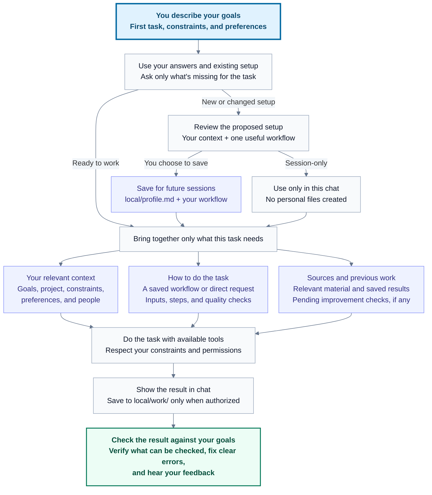
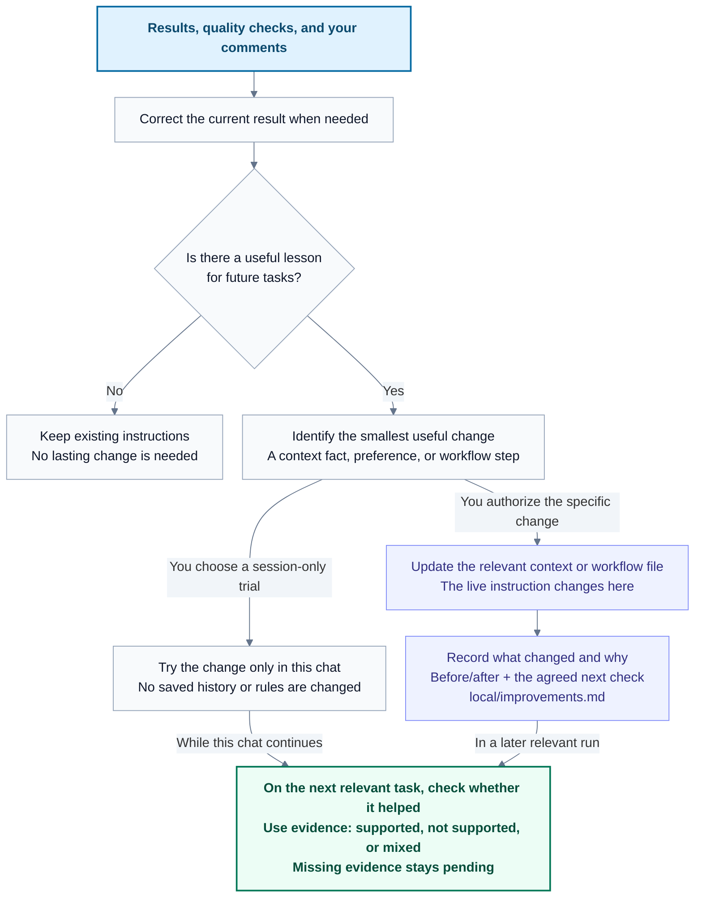

# Agent OS

A small, markdown-based workspace that helps an AI assistant understand your goals, repeat useful tasks, and keep work you can return to.

Start with one real task. Add more structure when you need it. “OS” is a metaphor: these are readable instructions and files, used by an AI tool you already have.

## Start here

1. In **Codex**, create a new local project using an empty folder on your computer, such as `my-agent-os`.
2. Open a chat in that project.
3. **Copy and paste this prompt** into the chatbox:

```text
Set up Agent OS in this project using this repository:
https://github.com/williswee/agent-os

Read its README, then copy the starter files, including .gitignore, into this folder without overwriting existing work. Follow AGENTS.md and commands/start.md to help me define my goals, first task, constraints, and preferences. Ask one topic at a time, using answers I've already given. Show me the proposed personal setup before saving it.
```

You can use the same prompt in Claude Code or Cursor with an empty folder open and file access enabled.

The assistant guides you through a short conversation about your goals, one useful first task, and the constraints and preferences it should respect. It turns your answers into a proposed setup for you to review and save. You can say “not sure”, skip optional details, or keep the setup only in this chat. You do not need to write the context files yourself.

**Already have the files, or prefer downloading a ZIP?** Extract the folder, open it in your AI tool, and paste this shorter prompt:

```text
Read AGENTS.md and follow commands/start.md to help me set up Agent OS.
```

Once the files are in place, you can also say **“Start Agent OS”**. These are ordinary chat messages; no slash command is required. If the assistant cannot retrieve the repository, use the ZIP route instead.

See the [quickstart](agent-os-quickstart.md) for using a downloaded copy, your first session, and troubleshooting.

## What you get

- **Context that fits your situation:** your goals, what success looks like, relevant background, constraints, and working preferences, based on what you choose to share.
- One repeatable workflow for a task you choose.
- Saved work you can review and continue in a later session.
- Improvements to your context and workflows based on results and feedback, with changes you can inspect and undo.
- Plain files you can edit, move, or back up yourself.

No installer, plugin, API key, terminal script, or external integration is required by this starter. Your AI tool still has its own account, usage costs, and file-access requirements. File-reading and file-writing capabilities are needed for the full experience.

## What the assistant asks you

Setup covers three topics, usually one at a time. The assistant uses answers you have already given and asks follow-up questions only when they help with your task.

| Topic | What it helps the assistant understand |
| --- | --- |
| **Your goals** — “What would you like help with?” | What you want to achieve, why it matters, and what a useful result would look like. |
| **Your first task** — “What's one useful thing to do first?” | What you are working on now, the input you have, and the result you need. |
| **Your constraints and preferences** — “What limits or preferences should I respect?” | Relevant deadlines, time available, tools or resources, things to avoid, and how you like answers presented. You can skip details that do not matter. |

You do not have to know all the answers. Start with enough context for one task; add detail as you use the workspace. The assistant should never assume your industry, country, job, or personal circumstances.

## How it works

Read from top to bottom. New users review a small setup; returning users reuse it.
Both paths lead to the same task and result check.



Your **context** explains what matters to you. A **workflow** explains how to repeat a task. **Sources and previous work** give the task relevant evidence and continuity. The assistant reads only what is useful; missing optional files never prevent a clear task from getting done.

Saving setup, saving an output, and saving a lasting improvement are separate choices.
An existing authorization counts; the assistant should not ask you to approve it again.

## How it improves over time

Agent OS can improve the instructions it uses by learning from results you can observe and feedback you provide. It updates your saved context and workflows; it does not retrain the underlying AI model.

The second view follows your feedback into the next relevant task. A correction can
fix today's result and also reveal a useful change for tomorrow.



“Remember this” or “update this workflow” already authorizes that specific change.
Other lasting changes are proposed for your approval. The history records evidence;
the context or workflow file holds the current instruction. You can keep, revise,
or undo an improvement after seeing whether it helped.

1. **Check the result.** Compare the output with your goal, constraints, and the workflow's quality checks. Fix clear mistakes within the current task.
2. **Understand your feedback.** Distinguish a correction for this answer from a preference or method that should apply next time.
3. **Make a small, targeted change.** Update the relevant file when you request it, or propose a change for you to approve. Saving task output alone does not authorize rewriting your workflow.
4. **Check whether it helped.** On the next relevant task, try the updated approach and compare against the agreed check. Keep, revise, or undo the change based on evidence.

| Your comment or result | How it can help |
| --- | --- |
| “This is too long. Make it shorter.” | Revise this answer without assuming a permanent preference. |
| “Remember: start these reports with three key points.” | Save that preference in the profile or existing preferences file, then use it for future reports. |
| “The plan missed the deadline. Add a deadline check to this workflow.” | Update that workflow and check the next plan against its deadline. |
| “This task took twice as long as the plan allowed.” | Treat your report as evidence, examine the estimate, and propose an adjustment to try; one result does not establish a universal rule. |

You can also say **“Agent OS improve”** to review a recent result and feedback together. With no useful change to make, the assistant should say so. Praise, silence, and the assistant's confidence are not proof that a workflow is better.

Saved improvements have a short record in `local/improvements.md`: why the change was made, what changed, and what to check next. The live context or workflow file contains the current instruction; the record is history. You can ask to undo a specific improvement. In session-only use, feedback stays in the conversation unless you ask to save it.

This loop runs while you work with the assistant. Outcomes outside the workspace need to be reported by you or supplied through an integration you choose; the starter does not monitor them in the background.

## Your context files, explained

A context file is a readable note the assistant consults when it is relevant to your request. **The first setup keeps your context together in `local/profile.md`.** You do not need to fill in a folder of documents before starting.

As your workspace grows, you can ask the assistant to move detailed topics into the optional files below. These are the supported places for that context; they are created only when useful and requested, not automatically during onboarding.

| Context file | What it means | When it is created |
| --- | --- | --- |
| `local/profile.md` | Your starting brief: purpose, goals, first task, constraints, preferences, and relevant facts you want remembered. It links to any additional context files. | When you save your first setup. |
| `local/context/goals.md` | What you want to achieve, your priorities, and how you will recognize success. | Optional, when goals need more detail than the profile. |
| `local/context/project.md` | What you are working on: background, current stage, intended audience, and decisions already made. For software work, this can include technical context. | Optional, when an ongoing project needs a shared brief. |
| `local/context/constraints.md` | The limits a good answer must respect: time, deadlines, available resources, required tools, and things to avoid. | Optional, when several tasks share important limits. |
| `local/context/preferences.md` | How you want to work with the assistant: tone, answer length, format, level of explanation, and collaboration style. | Optional, when working preferences need their own note. |
| `local/context/people.md` | Relevant roles, responsibilities, and collaborators. Include only information needed for the work; real names are not required. | Optional, when coordination with others matters. |

When a topic moves into a separate file, the profile links to it rather than keeping a second copy that could go out of date. Missing optional files never block your work.

Other locations support your context:

| Path | Purpose |
| --- | --- |
| `local/workflows/first-task.md` | The recipe for your chosen task: inputs, steps, expected output, a quality check, and whether to save the result. Created when you save setup. |
| `local/work/` | The actual plans, drafts, reviews, or other results you choose to save. These become useful context when you continue that work. |
| `local/improvements.md` | A small history of saved improvements, their reasons, and follow-up checks. Created when you save a reusable improvement; it is not a conversation transcript. |

## Where things live

| File or folder | Purpose |
| --- | --- |
| [AGENTS.md](AGENTS.md) | Short instructions for the assistant |
| [CLAUDE.md](CLAUDE.md) | Imports the same instructions for Claude Code |
| [commands/](commands/) | Setup, help, status, and improvement procedures |
| [templates/](templates/) | Blank starting formats, with no sample user's profile |
| `local/` | Your profile, workflows, and work; created during setup and ignored by Git |
| [agent-os-quickstart.md](agent-os-quickstart.md) | Beginner guide |
| [agent-os-blueprint.md](agent-os-blueprint.md) | Optional design reference for extending or rebuilding the system |
| [docs/review.md](docs/review.md) | Review of the original guides and remaining product decisions |
| [docs/acceptance.md](docs/acceptance.md) | Scenarios for checking the beginner experience |

## Your data

Personal setup and output stay under `local/` by default. Git ignores that folder; it is not an encrypted vault or a backup. Your AI provider may process files the assistant reads according to your tool's settings. Do not put passwords or API keys in your profile. This starter includes no telemetry or background jobs.

To share a workflow, ask the assistant to make a separate, sanitized copy and review it before publishing.

## Contributing and support

Questions, bug reports, and suggestions are welcome in [GitHub Issues](https://github.com/williswee/agent-os/issues). See [CONTRIBUTING.md](CONTRIBUTING.md) for how to contribute and report a problem without sharing personal context. [Compatibility notes](docs/compatibility.md) distinguish documented support from completed client tests.

## License

Agent OS is open source under the [MIT License](LICENSE). You can use, modify, and share it, including commercially, subject to the license terms.
